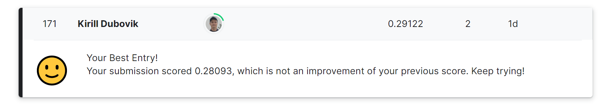

# Генерация названия научной статьи

## Постановка задачи
Задача: научить модель генерировать название научной статьи по её краткому описанию (аннотации).

---

## Практическая применимость проекта
Проект направлен на реализацию эффективного поиска информации из статей, конспектов и других учебных материалов и 
предназначен для учащихся школ, вузов, специалистов и научных работников.  
Реализованные методы могут быть перенесены для применения в поисковых системах и новостных агрегаторах.

---

## Описание данных

### Файлы

**- train.csv** - данные для обучения (135000 строк);  
**- test.csv** - тестовые данные (1000 строк);  
**- sample_submission.csv** - пример submission;  
**- vocs.pkl** - файл, необходимый для генерации submission.  
Данные [файлы](https://www.kaggle.com/competitions/title-generation/data) размещены на странице соревнования.

---

### Поля датасета

**- abstract** - текст аннотации  
**- title** - заголовок статьи

---

## Дополнительные сведения о проекте

Данная работа является решением последнего задания курса "Нейронные сети и обработка текста" на [Stepik'е](https://stepik.org/lesson/262255/step/1).  
Данное задание оформлено в виде соревнования на Kaggle [Arxiv Title Generation](https://www.kaggle.com/competitions/title-generation/).

---

## Установка

Для того чтобы запустить inference, вам нужно установить необходимые зависимости:
```
pip install -r requirements.txt
```
---

## ML-метрики

Для определения эффективности решения были использованы:
- [BLEU](https://en.wikipedia.org/wiki/BLEU);
- F-мера, по которой оценивается результат в соревновании Kaggle.

---

## Сравнение разных моделей

Было проведено сравнение двух seq2seq моделей:
- LSTM2LSTM (с использованием LSTM в качестве энкодера и декодера, а также attention-механизма - представленный бейзлайн соревнования Kaggle);
- BERT2BERT (с использованием BERT в качестве энкодера и декодера)

| Модель    | BLEU    | f-score |
|-----------|---------|---------|
| LSTM2LSTM | 0.28204 | 0.18296 |
| BERT2BERT | 0.38296 | 0.29122 |

---

## Подбор гиперпараметров

Для обучения модели параметры приняты по рекомендации из курса. 
- оптимизатор Adam;  
- learning rate: 2e-5  

Размер батча и количество эпох были приняты не на основании оптимального выбора, а в связи с ограничениями платформы Google Collab на время одной сессии.
По этой же причине не был произведен перебор различных параметров обучения.

---

## Оценка производительности модели

Модель на базе BERT сгенерировала 1000 заголовков за 2 минуты.

---

## Рекомендуемое оборудование

Для обучения модели BERT2BERT были использованы бесплатные мощности Google Collab.
Обучение, в связи с ограничениями платформы Google Collab, было проведено для одной эпохи и заняло 1 час 7 минут.
Рекомендуемое количество эпох: 2-4.

Исходя из сказанного выше, рекомендуемое оборудование имеет следующие характеристики:

| Тип | Модель                          |
|-----|---------------------------------|
| CPU | Intel Core i5-12500H            |
| GPU | NVIDIA GeForce RTX 3060, 12Gb   |
| RAM | Crucial DDR4 1600MHz 16Gb (8x2) |

---

## Оценка качества всего решения



---

## Возможность масштабирования

Данное решение возможно масштабировать:
- для поиска новостных статей;
- для поиска записей в социальных сетях;
- и т.п.

---

## License
[MIT](https://choosealicense.com/licenses/mit/)
